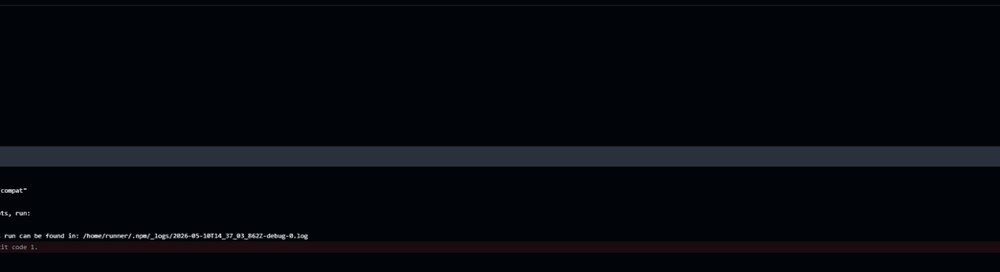

# Rel.AI MCP

```text
██████╗ ███████╗██╗         █████╗ ██╗    ███╗   ███╗ ██████╗██████╗
██╔══██╗██╔════╝██║        ██╔══██╗██║    ████╗ ████║██╔════╝██╔══██╗
██████╔╝█████╗  ██║        ███████║██║    ██╔████╔██║██║     ██████╔╝
██╔══██╗██╔══╝  ██║        ██╔══██║██║    ██║╚██╔╝██║██║     ██╔═══╝
██║  ██║███████╗███████╗   ██║  ██║██║    ██║ ╚═╝ ██║╚██████╗██║
╚═╝  ╚═╝╚══════╝╚══════╝   ╚═╝  ╚═╝╚═╝    ╚═╝     ╚═╝ ╚═════╝╚═╝

        I made this because I did not have Codex — so ChatGPT became my coder,
        and this local MCP bridge became the hands that can touch the repo.
```

Rel.AI MCP is the successor to my original Rel.AI project. The first version proved the idea: use ChatGPT web as the main reasoning engine, collect selected local workspace context, and apply the result locally. This version is the cleaner MCP/server version of that idea.

The goal is simple: I want the reasoning power of ChatGPT on the web, but I still want my repo to stay local, controlled, visible, and reversible.

```text
ChatGPT asks -> Rel.AI MCP reads/writes/verifies locally -> I inspect the diff -> I keep or reset it
```

The normal workflow is intentionally small:

```text
relai_repo_snapshot -> relai_read -> relai_write -> relai_verify -> relai_diff -> relai_reset
```

No generated Python edit scripts. No patch-script maze. No shell-edit fallback loops. No old multi-agent/task-runner workflows pretending to be reliable. One bridge workflow, because the broken ones were wasting time.

Rel.AI MCP still lightly nods to the original Rel.AI idea, but this README stands on its own: this is now a local MCP bridge for ChatGPT.

---

## What it does

Rel.AI MCP lets ChatGPT work with configured local workspaces through a trusted local server.

It can:

- snapshot a filtered repo tree
- read selected files or small directory summaries
- write full files, including staged writes for large files
- run verification commands such as tests/analyzers
- inspect git diffs
- reset local changes
- expose a local or public MCP URL for ChatGPT connectors
- optionally auto-approve ChatGPT app requests through a Chrome extension

It is built around the practical flow I kept needing:

```text
I describe the coding task
ChatGPT reasons about it
Rel.AI MCP gives it only the repo access it asks for
ChatGPT edits through full-file writes
Rel.AI MCP runs tests
I inspect the diff
```

---

## Screenshots

### Home

<p align="center">
  
</p>

The home screen shows the current bridge health, configured workspaces, validation state, and recent activity.

### Workspaces

<p align="center">
  
</p>

Workspace cards show detected commands, fast-task mode, protected branches, preflight actions, settings, rename, and delete controls.

### Activity

<p align="center">
  
</p>

The activity page is there because I got tired of guessing what the MCP server was doing. It shows recent tool calls, workspace, status, and expandable detail rows.

### Tools

<p align="center">
  
</p>

Normal mode exposes only the local bridge tools. Legacy shell/patch/task-runner workflows are not part of the public MCP surface.

### Chrome extension auto-approve

<p align="center">
  
</p>

Auto-approve is handled by a Chrome extension, not a userscript. It is optional and can be turned on when you want ChatGPT to keep moving through trusted Rel.AI MCP app requests while you supervise the run.

### Connector setup

<p align="center">
  
</p>

The connector page shows the MCP URL for ChatGPT. It supports local URLs and public URLs from one-click tunnel setup.

### Diagnostics

<p align="center">
  
</p>

Diagnostics are intentionally plain: health, readiness, and recent activity. No mystery panel, no fake magic.

<details>
<summary>Full screenshots</summary>

### Full home

<p align="center">
  
</p>

### Full workspaces

<p align="center">
  
</p>

### Full activity

<p align="center">
  
</p>

### Full tools

<p align="center">
  
</p>

### Full settings

<p align="center">
  
</p>

### Full connector

<p align="center">
  
</p>

### Full diagnostics

<p align="center">
  
</p>

</details>

---

## Why I made this

I made this because I did not have Codex available as the workflow I wanted.

I still wanted a Codex-like loop:

```text
understand the repo -> make the change -> run validation -> show the diff
```

But I wanted to drive it with ChatGPT web, especially the stronger reasoning models there. Copying files manually, uploading ZIPs, and pasting patches back into the project was too slow. The older Rel.AI project was my first answer to that problem. Rel.AI MCP is the next version: simpler, more direct, and built around MCP tools instead of a patch-heavy browser/native-host flow.

The important design choice: ChatGPT does the thinking, but the local bridge keeps the repo access explicit.

---

## Install

```bash
npm install
```

Run the local MCP server:

```bash
npm run oneclick
```

Run tests:

```bash
npm test
npm run test:compat
npm run test:http
npm run test:auto-approve
npm run test:tunnel
npm run test:oneclick
```

---

## One-click server and public tunnel

Local-only mode:

```bash
npm run oneclick
```

Start the server and try to create a public HTTPS tunnel automatically:

```bash
npm run oneclick -- --public
```

Provider shortcuts:

```bash
npm run oneclick -- --public ngrok
npm run oneclick -- --public cloudflare
npm run oneclick -- --public localtunnel
```

Shortcut flags are also supported:

```bash
npm run oneclick -- --ngrok
npm run oneclick -- --cloudflare
npm run oneclick -- --localtunnel
```

For other tunnel providers, use a custom command that prints a public `https://` URL:

```bash
npm run oneclick -- --tunnel custom --tunnel-command "your-tunnel http://127.0.0.1:3333"
```

For a stable domain:

```bash
npm run oneclick -- --public-url https://your-domain.example
```

The dashboard connector page prints the final ChatGPT MCP URL.

---

## ChatGPT connector setup

1. Start the server with `npm run oneclick` or a public tunnel command.
2. Open the dashboard.
3. Go to **Settings -> Connector**.
4. Copy the MCP URL.
5. In ChatGPT, add it as an MCP connector.
6. Use **No Authentication** if you are using the generated secret URL.

---

## Chrome extension auto-approve

Rel.AI MCP includes an optional Chrome extension for ChatGPT web app-request approvals.

Install it as an unpacked extension:

```text
chrome://extensions
-> Developer mode
-> Load unpacked
-> select public/extensions/chrome-auto-approve
```

Then enable it in two places:

1. Dashboard setting: **ChatGPT web app-request auto-approve**
2. Chrome extension popup toggle

This is meant to reduce repetitive approval clicks for trusted local work. It is not trying to be scary, but it is powerful: when enabled, it can approve Rel.AI MCP requests for repo reads, writes, verifies, diffs, browser checks, and resets. Use it when you are actively working, then turn it off when you are done.

The previous userscript workflow was removed because background-tab behavior and selector reliability were not good enough.

See [`docs/AUTO_APPROVE_EXTENSION.md`](docs/AUTO_APPROVE_EXTENSION.md).

---

## MCP tools

| Tool | Purpose |
| --- | --- |
| `relai_repo_snapshot` | Return a filtered project snapshot, manifests, discovered commands, and context hints. |
| `relai_read` | Read focused files or directory summaries. |
| `relai_write` | Replace one complete file with corrected full-file content. Large writes can be staged through the same tool. |
| `relai_verify` | Run detected or requested verification commands. |
| `relai_browser` | Run a browser/UI check or fetch a route. |
| `relai_diff` | Review git status and diff. |
| `relai_reset` | Roll back requested local changes. |

Removed workflows are not part of the MCP anymore: patch application loops, generated patch scripts, shell-edit tools, task runners, isolated worktree orchestration, multi-agent schedulers, Docker runners, and PR/CI repair loops.

---

## Fast task mode

Each workspace can define fast-task behavior:

```json
{
  "fastTask": {
    "enabled": true,
    "preferChangedFiles": true,
    "skipIndexForSmallTasks": true,
    "maxIndexFiles": 750,
    "includeRoots": [],
    "excludePaths": [".git", "node_modules", "build", "dist", "coverage"]
  }
}
```

Use `.relaiignore` in a repo to add repo-specific AI-context exclusions.

The point is to avoid the slow version of AI coding where the tool scans the world before touching the obvious files.

---

## Verify command behavior

`relai_verify` can run explicit commands inside configured workspaces:

```json
{ "workspace": "jjclover", "commands": ["flutter analyze", "flutter test"] }
```

```json
{ "workspace": "rel-ai-mcp", "commandsText": "npm run check\nnpm run test:compat" }
```

If no command is provided, it auto-detects sensible validation commands for the workspace.

---

## Full-file write behavior

`relai_write` accepts complete file content only.

Small write:

```json
{
  "workspace": "myapp",
  "path": "src/example.ts",
  "content": "export const ok = true;\n"
}
```

Large write through the same tool:

```json
{ "workspace": "myapp", "stage": "start", "path": "src/big.ts", "content": "first chunk" }
{ "workspace": "myapp", "stage": "append", "writeId": "...", "content": "next chunk" }
{ "workspace": "myapp", "stage": "commit", "writeId": "..." }
```

If a multiline source file is accidentally collapsed into one long line, the write is rejected instead of damaging formatting.

---

## CI compatibility

<p align="center">
  
</p>

The package keeps CI aliases that older workflows may call:

```bash
npm run test:compat
npm run test:loose-patch
npm run test:public-workflow
```

`test:loose-patch` is now a compatibility guard that confirms the removed patch workflow stays removed. `test:public-workflow` runs the current bridge workflow smoke test.

---

## Design notes

Rel.AI MCP is intentionally opinionated now.

- One normal workflow is better than five fallback workflows that fail differently.
- Full-file writes are easier to reason about than hidden mini-patches.
- Verification should be visible and repeatable.
- Auto-approve belongs in a browser extension, not a fragile userscript.
- Public tunnel setup should be easy, but local-only should stay the default.
- The dashboard should explain what is happening instead of hiding everything in logs.

---

## Attribution

Built and maintained by [@Kyne0328](https://github.com/Kyne0328).
