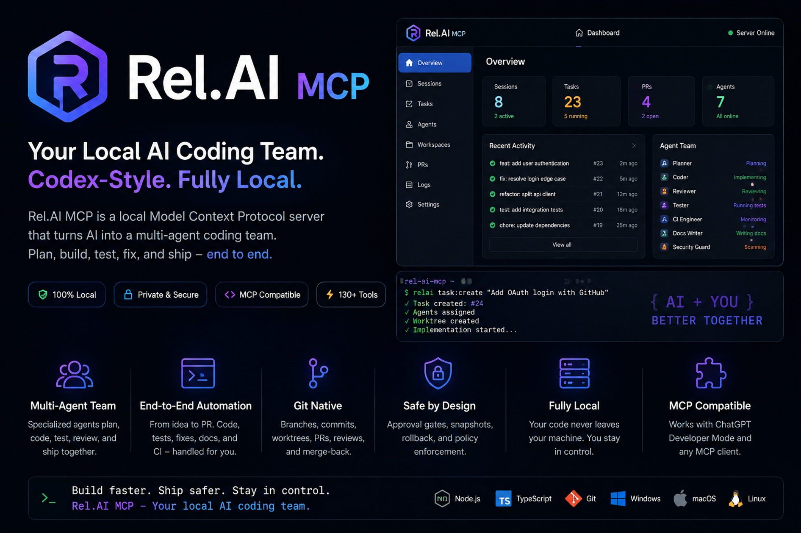

# Rel.AI MCP



**Rel.AI MCP is a local MCP server that turns ChatGPT into a Codex-style coding team.**

It gives ChatGPT controlled access to your local projects so it can plan work, create isolated Git worktrees, edit files, run tests, inspect failures, commit changes, and prepare pull requests without sending your code to a hosted coding agent.

## Why this exists

Rel.AI MCP is built for developers who want AI-assisted coding with local control.

Instead of giving a remote service access to your repository, you run Rel.AI MCP on your own machine. ChatGPT talks to it through the Model Context Protocol, and Rel.AI MCP handles the local coding workflow safely.

## What it can do

- **Create task sessions** for each coding request.
- **Create isolated worktrees** so changes do not touch your main checkout.
- **Read, search, and edit project files** through controlled tools.
- **Apply patches and safe text writes** with policy checks.
- **Run tests and commands** from an allowlisted command set.
- **Inspect failures and iterate** until the task is complete.
- **Track background jobs** for longer-running commands.
- **Commit changes, push branches, and create draft PRs**.
- **Check release readiness, workspace health, and connector setup**.
- **Use a local dashboard** to monitor sessions, tasks, agents, readiness, and activity.

## How the workflow looks

```text
You ask ChatGPT to build or fix something
        ↓
ChatGPT creates a Rel.AI MCP task session
        ↓
Rel.AI MCP creates an isolated Git worktree
        ↓
Agents plan, edit, test, review, and fix
        ↓
Rel.AI MCP commits the result and prepares a draft PR
        ↓
You review, approve, merge, or discard the worktree
```

## Core concepts

| Concept | Meaning |
| --- | --- |
| **Workspace** | A local repository Rel.AI MCP is allowed to work in. |
| **Session** | A coding task with its own state, plan, logs, and worktree. |
| **Worktree** | An isolated Git checkout used for one task. |
| **Agent** | A specialized role such as planner, coder, reviewer, tester, or docs writer. |
| **Approval gate** | A policy checkpoint before risky file, command, Git, or PR actions. |
| **Dashboard** | The local web UI for monitoring sessions, readiness, agents, jobs, and PR flow. |

## One-command start

For the easiest local setup:

```bash
npm install
npm run oneclick
```

This creates a local config if needed, generates a persistent bearer token, starts the HTTP server, and prints the dashboard plus ChatGPT MCP endpoint.

For a permanent ChatGPT app, use a stable HTTPS tunnel or reverse proxy and launch with:

```bash
npm run oneclick -- --public-url https://relai.your-domain.com
```

Then configure ChatGPT Developer Mode once with:

```text
https://relai.your-domain.com/mcp
Authorization: Bearer <REL_AI_MCP_TOKEN>
```

Full guide: [docs/ONE_CLICK_SETUP.md](docs/ONE_CLICK_SETUP.md)

## Dashboard

The one-command launcher prints a local dashboard URL. You can also start the HTTP server directly:

```bash
npm run start:http
```

Then open the local dashboard shown by the server output.

The dashboard includes:

- Session, task, PR, and agent status cards
- Recent activity feed
- Agent team status
- Release readiness checks
- Workspace preflight checks
- Health and connector diagnostics
- Raw dashboard data for debugging

## Install

Rel.AI MCP requires Node.js 18 or newer.

```bash
npm install
npm run check
```

Create or update your local configuration:

```bash
npm run init-config
```

Add a workspace:

```bash
npm run workspace:add
```

Add safe commands ChatGPT is allowed to run:

```bash
npm run testcmd:add
npm run cmd:add
```

## Connect to ChatGPT Developer Mode

Start with the easier setup guide:

[docs/ONE_CLICK_SETUP.md](docs/ONE_CLICK_SETUP.md)

The deeper connector guide is here:

[docs/CONNECTING_TO_CHATGPT.md](docs/CONNECTING_TO_CHATGPT.md)

At a high level:

1. Run `npm run oneclick`.
2. Put a stable HTTPS tunnel in front of `http://127.0.0.1:3333`.
3. Run `npm run oneclick -- --public-url https://your-stable-domain`.
4. Configure one ChatGPT app with `https://your-stable-domain/mcp`.
5. Ask ChatGPT to inspect or work on one of your configured workspaces.

## Safety model

Rel.AI MCP is designed to keep the user in control.

- Your code stays on your machine.
- Work happens in isolated Git worktrees.
- Commands must be allowlisted.
- Sensitive operations can require approval.
- State files are parsed safely and corrupted state is handled defensively.
- Workspace preflight checks warn before risky operations.
- Release-readiness checks verify configuration before real use.

For more detail, read:

[docs/SECURITY.md](docs/SECURITY.md)

## Useful commands

```bash
npm run oneclick       # One-command local launch + connector summary
npm run connector:print # Print saved connector settings/token
npm run check          # Syntax-check project files
npm run test:smoke     # Basic MCP smoke test
npm run test:http      # HTTP server smoke test
npm run test:workflow  # End-to-end workflow smoke test
npm run test:v9        # Product UX smoke test
npm run test:v10       # Release-readiness smoke test
```

## Project structure

```text
bin/        CLI entrypoints
src/        MCP server, dashboard, agents, Git, policy, safety, and workflow code
docs/       Setup, security, release, and planning docs
examples/   Example connector and config files
test/       Smoke and release tests
```

## Version

Current version: `0.11.0`

v0.11.0 adds one-command startup, persistent local connector profiles, stable public URL support, and dashboard setup guidance so users do not need to recreate the ChatGPT app every time a temporary tunnel URL changes.

## Status

Rel.AI MCP is an active local-first coding-agent project. Treat it as developer tooling: review generated changes, keep command allowlists tight, and use draft PRs for final verification.
