# Rel.AI MCP

```text
██████╗ ███████╗██╗         █████╗ ██╗    ███╗   ███╗ ██████╗██████╗
██╔══██╗██╔════╝██║        ██╔══██╗██║    ████╗ ████║██╔════╝██╔══██╗
██████╔╝█████╗  ██║        ███████║██║    ██╔████╔██║██║     ██████╔╝
██╔══██╗██╔══╝  ██║        ██╔══██║██║    ██║╚██╔╝██║██║     ██╔═══╝
██║  ██║███████╗███████╗   ██║  ██║██║    ██║ ╚═╝ ██║╚██████╗██║
╚═╝  ╚═╝╚══════╝╚══════╝   ╚═╝  ╚═╝╚═╝    ╚═╝     ╚═╝ ╚═════╝╚═╝

        I made this because I did not have Codex — so ChatGPT became my coder,
        and this local MCP bridge became the hands that can touch the repo.
```

Rel.AI MCP is the successor to my original Rel.AI project. The first version proved the idea: use ChatGPT web as the main reasoning engine, collect selected local workspace context, and apply the result locally. This version is the cleaner MCP/server version of that idea.

The goal is simple: I want the reasoning power of ChatGPT on the web, but I still want my repo to stay local, controlled, visible, and reversible.

```text
ChatGPT asks -> Rel.AI MCP inspects, changes, validates, and reviews locally -> I inspect the diff -> I keep or restore it
```

The default public ChatGPT workflow is intentionally small and predictable:

```text
relai_repo_snapshot -> relai_read -> relai_replace/relai_write/relai_clear_files -> relai_run_checks -> relai_diff -> relai_restore_changes
```

No generated Python edit scripts. No update-helper maze. No local-edit fallback loops. No old multi-agent/task-runner workflows pretending to be reliable. The public MCP surface stays limited to the workspace tools ChatGPT actually needs, while newer local bridge sessions can opt into a few extra helper tools for trusted continuity.

Rel.AI MCP still lightly nods to the original Rel.AI idea, but this README stands on its own: this is now a local MCP bridge for ChatGPT.

---

## What it does

Rel.AI MCP lets ChatGPT work with configured local workspaces through a trusted local server.

It can:

- snapshot a filtered repo tree
- read selected files or small directory summaries
- write full files, apply exact localized replacements, clear obsolete files, and stage whole-file writes only when unavoidable
- optionally apply prepared text updates or file bundles for larger workspace edits
- run validation checks such as tests/analyzers
- inspect git diffs
- run explicit git status, fetch, commit, push, merge-planning, merge-abort, and PR-draft flows
- scan for semantic refactor residue across source, tests, docs, UI, and data-shaped files
- restore local changes
- expose packaging, readiness, and feature-probe helpers on the public workspace-tool surface
- expose a local or public MCP URL for ChatGPT connectors
- optionally use Chrome extension approval assistance for ChatGPT app requests

It is built around the practical flow I kept needing:

```text
I describe the coding task
ChatGPT reasons about it
Rel.AI MCP gives it only the repo access it asks for
ChatGPT edits through exact replacements or full-file writes
Rel.AI MCP runs tests
I inspect the diff
```

---

## Screenshots

### Home

<p align="center">
  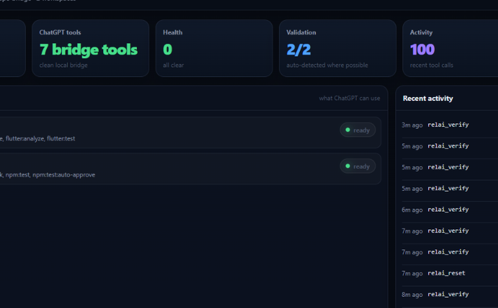
</p>

The home screen shows the current bridge health, configured workspaces, validation state, and recent activity.

### Workspaces

<p align="center">
  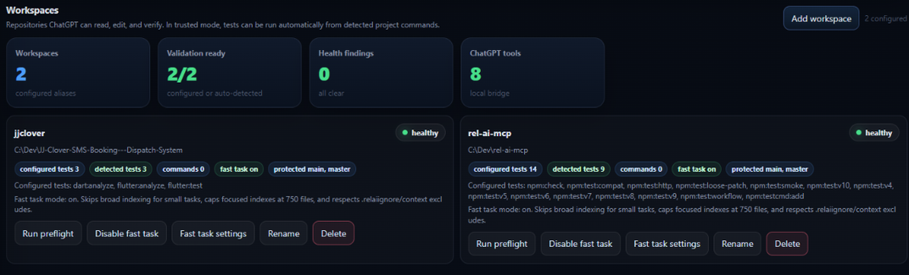
</p>

Workspace cards show detected checks, workspace scope settings, protected branches, preflight actions, rename, and clear controls.

### Activity

<p align="center">
  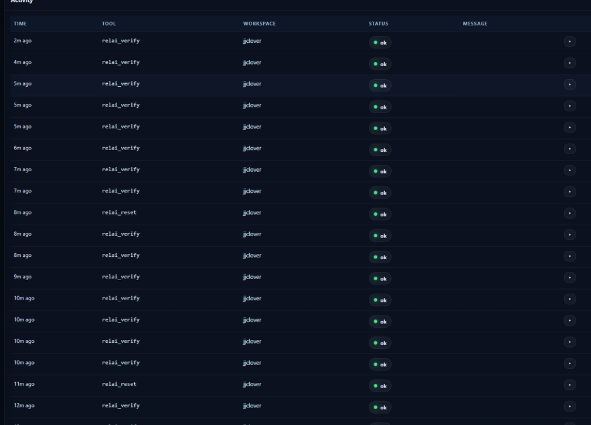
</p>

The activity page is there because I got tired of guessing what the MCP server was doing. It shows recent tool calls, workspace, status, and expandable detail rows.

### Tools

<p align="center">
  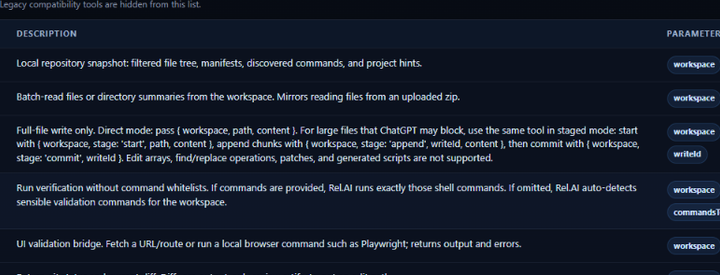
</p>

The dashboard shows the 24 public workspace tools ChatGPT can use for inspect, change, validate, review, git orchestration, refactor auditing, packaging, and restore workflows. Internal helper tools are not part of the public MCP surface.

### Chrome extension auto-approve

<p align="center">
  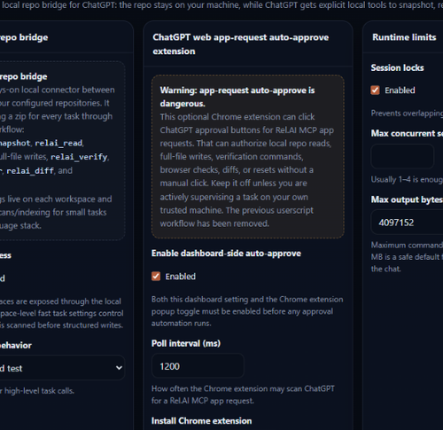
</p>

Request approval assistance is handled by a Chrome extension, not a userscript. It is optional and can be turned on when you want ChatGPT to continue through Rel.AI MCP app requests while you supervise the run.

### Connector setup

<p align="center">
  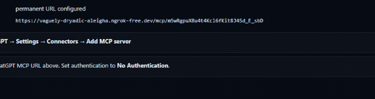
</p>

The connector page shows the MCP URL for ChatGPT. It supports local URLs and public URLs from one-click tunnel setup.

### Diagnostics

<p align="center">
  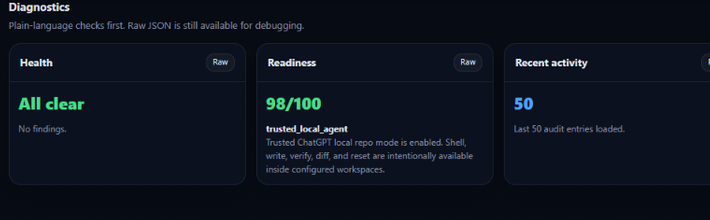
</p>

Diagnostics are intentionally plain: health, readiness, and recent activity. No mystery panel, no fake magic.

<details>
<summary>Full screenshots</summary>

### Full home

<p align="center">
  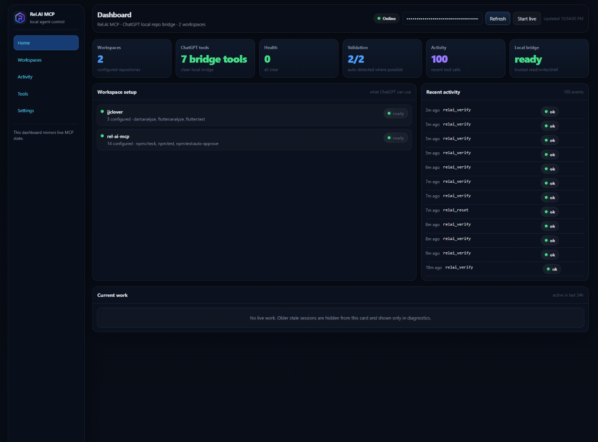
</p>

### Full workspaces

<p align="center">
  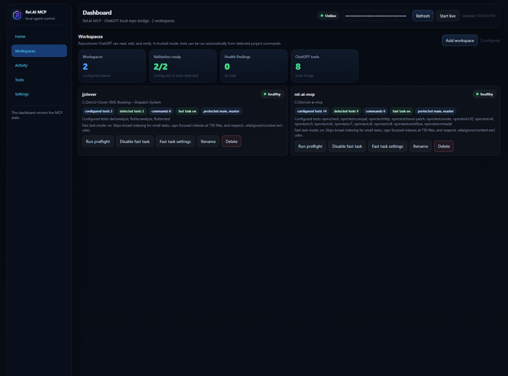
</p>

### Full activity

<p align="center">
  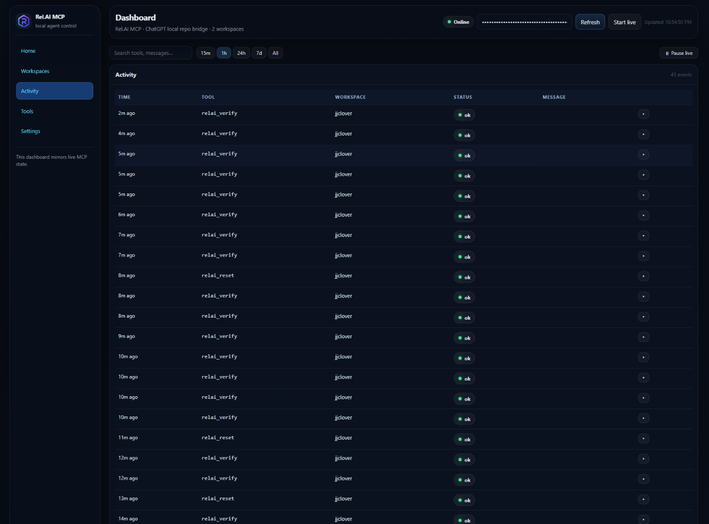
</p>

### Full tools

<p align="center">
  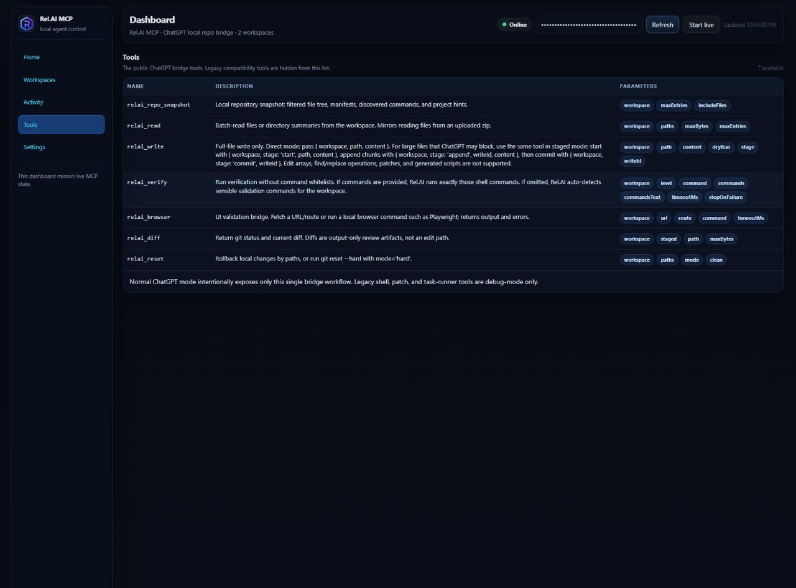
</p>

### Full settings

<p align="center">
  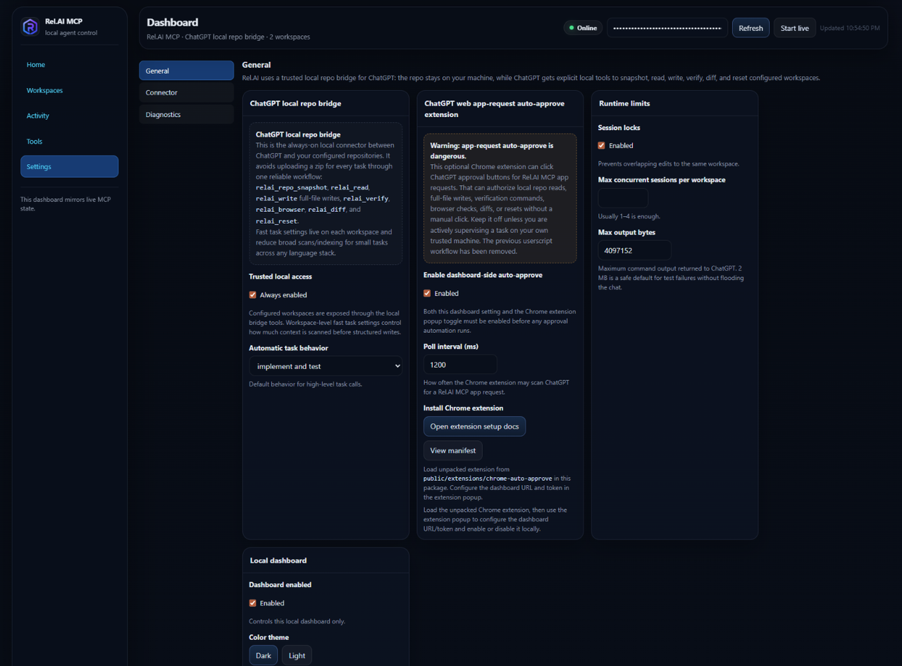
</p>

### Full connector

<p align="center">
  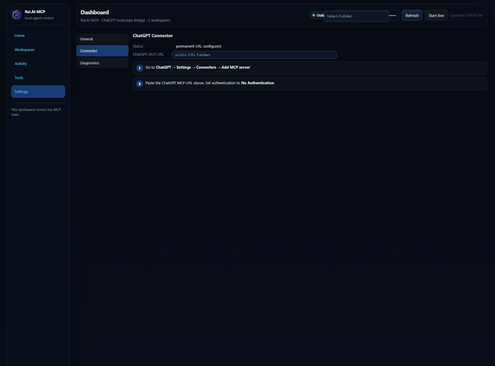
</p>

### Full diagnostics

<p align="center">
  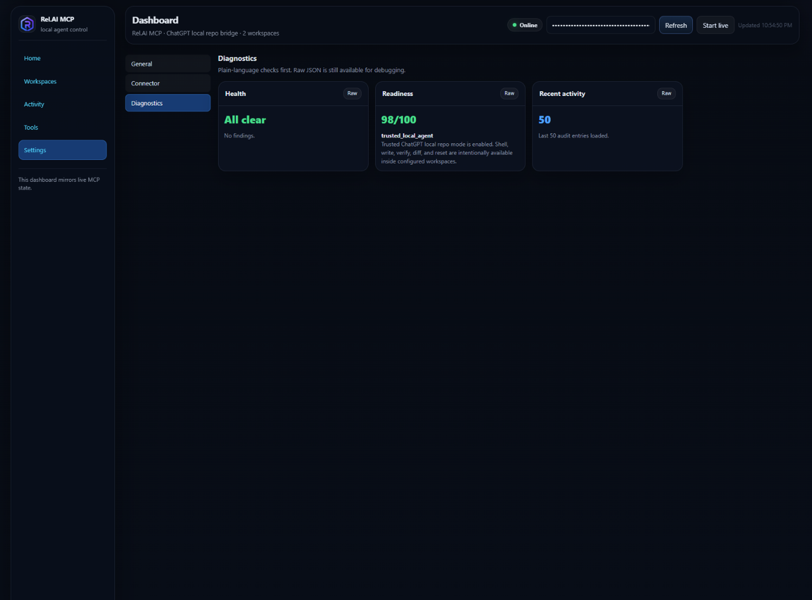
</p>

</details>

---

## Why I made this

I made this because I did not have Codex available as the workflow I wanted.

I still wanted a Codex-like loop:

```text
understand the repo -> make the change -> run validation -> show the diff
```

But I wanted to drive it with ChatGPT web, especially the stronger reasoning models there. Copying files manually, uploading ZIPs, and pasting updatees back into the project was too slow. The older Rel.AI project was my first answer to that problem. Rel.AI MCP is the next version: simpler, more direct, and built around MCP tools instead of a update-heavy browser/native-host flow.

The important design choice: ChatGPT does the thinking, but the local bridge keeps the repo access explicit.

---

## Install

```bash
npm install
```

Run the local MCP server:

```bash
npm run oneclick
```

Run tests:

```bash
npm test
npm run test:compat
npm run test:http
npm run test:auto-approve
npm run test:tunnel
npm run test:oneclick
```

---

## One-click server and public tunnel

Local-only mode:

```bash
npm run oneclick
```

Start the server and try to create a public HTTPS tunnel automatically:

```bash
npm run oneclick -- --public
```

Provider shortcuts:

```bash
npm run oneclick -- --public ngrok
npm run oneclick -- --public cloudflare
npm run oneclick -- --public localtunnel
```

Shortcut flags are also supported:

```bash
npm run oneclick -- --ngrok
npm run oneclick -- --cloudflare
npm run oneclick -- --localtunnel
```

For other tunnel providers, use a custom command that prints a public `https://` URL:

```bash
npm run oneclick -- --tunnel custom --tunnel-command "your-tunnel http://127.0.0.1:3333"
```

For a stable domain:

```bash
npm run oneclick -- --public-url https://your-domain.example
```

The dashboard connector page prints the final ChatGPT MCP URL.

---

## ChatGPT connector setup

1. Start the server with `npm run oneclick` or a public tunnel command.
2. Open the dashboard.
3. Go to **Settings -> Connector**.
4. Copy the MCP URL.
5. In ChatGPT, add it as an MCP connector.
6. Set authentication to **OAuth**. ChatGPT opens a sign-in page — enter your Rel.AI dashboard token (`REL_AI_MCP_TOKEN`) to approve.

---

## Chrome extension auto-approve

Rel.AI MCP includes an optional Chrome extension for ChatGPT web app-request approval assistance.

Install it as an unpacked extension:

```text
chrome://extensions
-> Developer mode
-> Load unpacked
-> select public/extensions/chrome-auto-approve
```

Enable it using the Chrome extension popup toggle. The dashboard does not need to be enabled.

This is meant to reduce repetitive approval clicks during supervised local work. When enabled, it can approve Rel.AI MCP requests for repo reads, writes, run checks, diffs, browser checks, and restores. Use it only while you are actively working, then turn it off when you are done.

The previous userscript workflow was removed because background-tab behavior and selector reliability were not good enough.

See [`docs/AUTO_APPROVE_EXTENSION.md`](docs/AUTO_APPROVE_EXTENSION.md).

---

## MCP tools

Rel.AI exposes one peer-level public workspace-tool surface. ChatGPT chooses the tool from the task shape and file size, not from separate tool tiers. The public surface has 24 tools, including first-class git and refactor-audit flows; newer local stdio sessions can expose 3 additional trusted-session helpers for continuity:

- `relai_edit`
- `relai_set_policy`
- `relai_session_summary`

| Tool | Purpose |
| --- | --- |
| `relai_repo_snapshot` | Return a filtered project snapshot, manifests, discovered checks, context hints, and size-based write guidance. |
| `relai_read` | Read focused files or directory summaries and return file-level write guidance. |
| `relai_write` | Replace one complete file with corrected full-file content. Direct mode is for normal-sized files; staged mode is for larger complete-file replacement. |
| `relai_replace` | Apply small exact text replacements inside an existing file. This is the preferred tool for large/interpolation-heavy source files, duplicate import cleanup, lint-only string edits, and localized behavior changes. |
| `relai_clear_files` | Clear obsolete files without update helpers. |
| `relai_apply_update` | Apply a prepared text update when a change is naturally patch-shaped across files. |
| `relai_apply_bundle` | Apply a prepared file bundle when many files need to be overlaid together. |
| `relai_package_snapshot` | Create a workspace zip package on the MCP host. |
| `relai_run_checks` | Run detected or requested validation checks. |
| `relai_browser` | Run a browser/UI check or fetch a route. |
| `relai_diff` | Review git status and diff. |
| `relai_restore_changes` | Restore selected workspace changes. |
| `relai_status` | Return compact live status for configured workspaces and scripts. |
| `relai_feature_probe` | Return compact booleans for important runtime behavior. |

Removed workflows are not part of the MCP anymore: update application loops, generated update helpers, local-edit tools, task runners, isolated worktree orchestration, multi-agent schedulers, Docker runners, and PR/CI repair loops.

---

## Workspace context mode

Each workspace can define how repository context is collected:

```json
{
  "fastTask": {
    "enabled": true,
    "preferChangedFiles": true,
    "skipIndexForSmallTasks": true,
    "maxIndexFiles": 750,
    "includeRoots": [],
    "excludePaths": [".git", "node_modules", "build", "dist", "coverage"]
  }
}
```

Use `.relaiignore` in a repo to add repo-specific AI-context exclusions.

The point is to avoid scanning unrelated files before touching the obvious files.

---

## Validation check behavior

`relai_run_checks` can run explicit validation checks inside configured workspaces:

```json
{ "workspace": "jjclover", "checks": ["flutter analyze", "flutter test"] }
```

```json
{ "workspace": "rel-ai-mcp", "checksText": "npm run check\nnpm run test:compat" }
```

If no check is provided, it auto-detects sensible validation checks for the workspace.

---

## Tool selection guide

Use this guide together with the `writeGuidance` returned by `relai_repo_snapshot` and `relai_read`.

| Situation | Use |
| --- | --- |
| Need a repository overview | `relai_repo_snapshot` |
| Need focused file content | `relai_read` |
| Small localized edit inside an existing file | `relai_replace` |
| Complete replacement of a small or normal-sized file | direct `relai_write` |
| Complete replacement of a larger file | staged `relai_write` |
| Multi-file patch-shaped change | `relai_apply_update` |
| Prepared file bundle update | `relai_apply_bundle` |
| Remove obsolete files | `relai_clear_files` |
| Run validation | `relai_run_checks` |
| Browser or UI route check | `relai_browser` |
| Review changes | `relai_diff` |
| Restore selected changes | `relai_restore_changes` |

Typical loop:

```text
inspect -> read -> change -> validate -> review -> restore only if needed
```

For large or interpolation-heavy files, prefer `relai_replace` for focused edits. Use staged `relai_write` only when the entire file genuinely needs replacement. For multi-file patch-shaped changes, use `relai_apply_update`. For prepared bundles on the MCP host, use `relai_apply_bundle`.

---

## Full-file write behavior

`relai_write` accepts complete file content only. Use `relai_replace` for localized edits inside existing files and `relai_clear_files` for file clearing.

Small full-file write:

```json
{
  "workspace": "myapp",
  "path": "src/example.ts",
  "content": "export const ok = true;\n"
}
```

Large complete-file write through the same tool:

```json
{ "workspace": "myapp", "stage": "start", "path": "src/big.ts", "content": "first chunk" }
{ "workspace": "myapp", "stage": "append", "writeId": "...", "content": "next chunk" }
{ "workspace": "myapp", "stage": "commit", "writeId": "..." }
```

Preferred localized edit inside a large or interpolation-heavy source file:

```json
{
  "workspace": "myapp",
  "path": "lib/sms_handler_utils.dart",
  "expectedSha256": "sha-from-relai-read",
  "oldText": "exact current text block",
  "newText": "exact replacement text block"
}
```

Obsolete file file clearing:

```json
{ "workspace": "myapp", "paths": ["docs/old-plan.md"] }
```

For long, large, or interpolation-heavy source files, prefer `relai_replace` for small exact edits. Use staged `relai_write` only when the whole file genuinely needs replacement. If a full-file or staged payload is too large, re-read the file and retry with smaller `relai_replace` operations. If a multiline source file is accidentally collapsed into one long line, the write is rejected instead of damaging formatting.

---

## Compatibility test aliases

The package keeps only active workflow test aliases:

```bash
npm run test:compat
npm run test:public-workflow
npm run test:connector-wording
```

`test:compat` confirms removed legacy tools stay rejected. `test:public-workflow` runs the current bridge workflow smoke test. `test:connector-wording` checks connector-facing wording so tool copy stays neutral and workflow-oriented. No CI screenshot belongs in the README; the README should show the product, not a failed run.

---

## Design notes

Rel.AI MCP is intentionally opinionated now.

- One normal workflow is better than five fallback workflows that fail differently.
- Full-file writes are easier to reason about than hidden mini-updatees.
- Verification should be visible and repeatable.
- Request approval assistance belongs in a browser extension, not a fragile userscript.
- Public tunnel setup should be easy, but local-only should stay the default.
- The dashboard should explain what is happening instead of hiding everything in logs.

---

## Attribution

Built and maintained by [@Kyne0328](https://github.com/Kyne0328).
